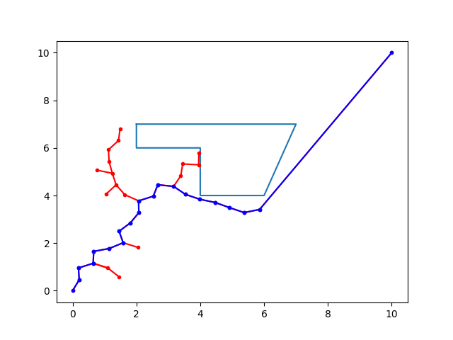
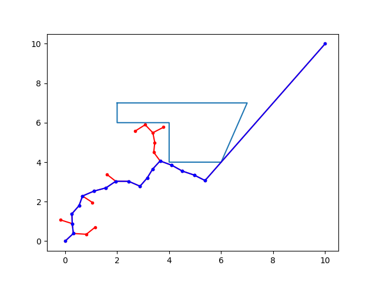
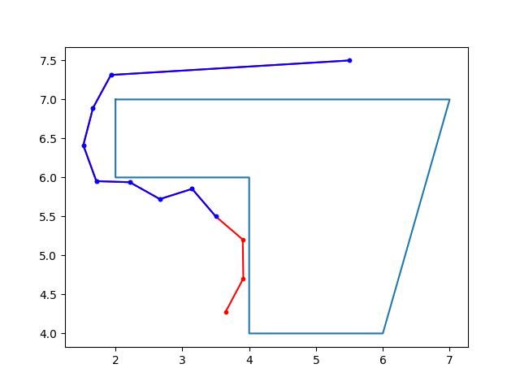
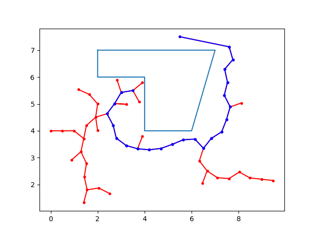

# RRT 

A C++ implementation of RRT using Boost::geometry and matplotlib-cpp

## Installation

```bash
git clone https://github.com/archit2604/RRT.git
```

## Running the code

To plan a path using the RRT algorithm use the following commands. The obstacle co-ordinates and the search space is fixed.

```bash
cd ./RRT
g++ rrt.cpp -std=c++11 -I/usr/include/python2.7 -lpython2.7
./a.out
```
Once you run the file, it will ask for user inputs for various fields, choose the values from permissible ranges mentioned. 

---

## Variable taken from user and their definitions

- start_x (float) : x-coordinate of the start point

- start_y (float) : y-coordinate of the start point

- goal_x (float) : x-coordinate of the goal point

- goal_y (float) : y-coordinate of the goal point

- K (int) : maximum number of nodes in the tree

- step (float) : step-size for RRT

- g_sampling (int) : goal sampling rate

### Conditions:
- start_x , start_y , goal_x and goal_y should be inside the search space and outside obstacles.
- K should be less than 500.
- step should be preferably a low value, to increase the possibility of getting a path.
- Set g_sampling to 0 to get an unbiased tree.
- If g_sampling is 5, the every 5 th sample is goal.

---

## Changing the Obstacle Co-ordinates

To change the Obstacle Co-ordinates the `line 18` in the file  ` rrt.cpp ` needs to be edited.

```cpp
int obst_array[][2] = {{2, 7}, {7, 7}, {6, 4}, {4, 4}, 
{4, 6}, {2, 6}};
```
## Changing the Search Space

The search space is a square with (0,0) and (12,12) as the opposite edges. To change the Search Space the `line 54-55` in the file  ` rrt.cpp ` needs to be edited.

```cpp
int Offset = 0;
int Range = 13;
```

To set the search space to any square with (a,a) and (b,b) as the opposite edges change the code to:

```cpp
int Offset = a;
int Range = b+1;
```

---

## Plots 

### Figure-1
- start : (0,0)

- goal : (10,10)

- K : 100

- step : 0.5

#### Without Bias ( g_sampling : 0 )



#### With Bias ( g_sampling : 25 )



---

### Figure-2
- start : (3.5,5.5)

- goal : (5.5,7.5)

- K : 100

- step : 0.5

#### Without Bias ( g_sampling : 0 )



#### With Bias ( g_sampling : 25 )


